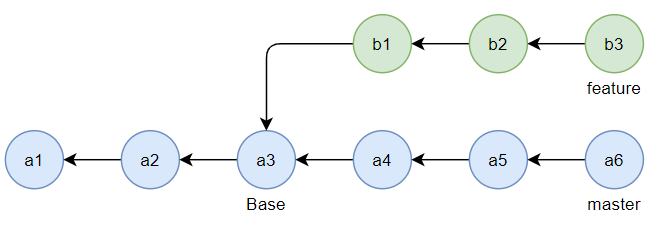
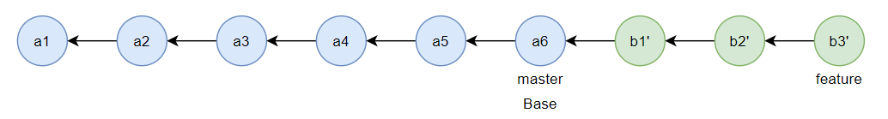

# rebase

Git에서 두 개의 브랜치를 하나로 합칠 때 두 가지 방식이 있는데 하나는 자주 사용하는 `merge` 이고 하나는 `rebase`이다.

`rebase`는 `merge`와는 다르게 브랜치의 분기점 base 자체를 재설정한다.

따라서 `merge`처럼 병합 시 merge commit 이력이 생기지 않는다.

다만 `rebase`의 경우 base를 재설정해버리기 때문에 commit의 근간 자체를 수정해버리는 행위여서 공동 작업을 할 때 더 위험할 수 있다.

이해를 쉽게 하기 위한 이미지이다.

git에서 a3 커밋을 기준으로 브랜치가 다음과 같이 분리가 되어 작업이 진행되었을때,
b1, b2, b3의 커밋 작업 이력이 있는 feature 브랜치를 a6으로 `rebase`를 하면 a6커밋으로 base를 재설정하겠다는 뜻이므로
충돌이 일어나지 않는 한 병합된다.
